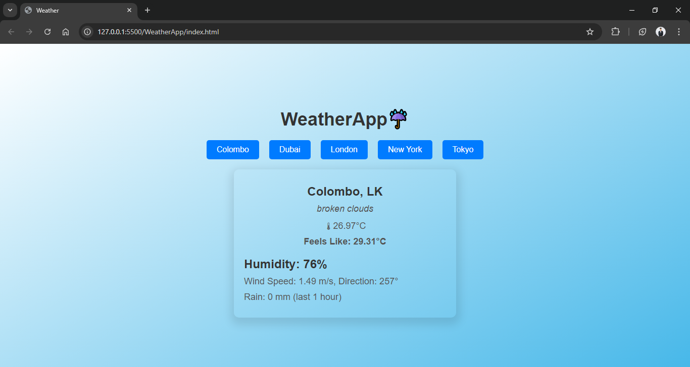

# WeatherApp☔
WeatherApp is a simple, interactive web application that provides real-time weather information for various cities around the world. Using the OpenWeatherMap API, this app displays key weather details, including temperature, humidity, wind speed, and more, with a user-friendly interface and sleek design.

## Features
City Selection: Users can select from a list of cities (Colombo, Dubai, London, New York, Tokyo) to view their current weather.
Real-Time Data: The weather information is fetched dynamically from the OpenWeatherMap API, ensuring up-to-date results.
Detailed Weather Information: Includes temperature, feels-like temperature, humidity, wind speed and direction, and rainfall data.
Responsive Design: The layout is designed to be responsive and visually appealing across all screen sizes.
Interactive UI: The weather information updates instantly when a city is selected via the buttons provided.

## Technologies Used
- HTML for the structure of the page.
- CSS for styling and creating a clean, modern UI.
- JavaScript for fetching weather data and dynamically updating the page.
- OpenWeatherMap API to fetch live weather data.

## How to Use
- Clone or download the repository.
- Open the index.html file in your browser.
- Click any of the city buttons to view the current weather for that city.
- The weather information will appear with temperature, wind, humidity, and more.

## Setup Instructions
- API Key: To get weather data, you will need an API key from OpenWeatherMap. Replace API_KEY in the config.js file with your personal API key.
Local Setup: Open the index.html in your browser to run the app locally.

